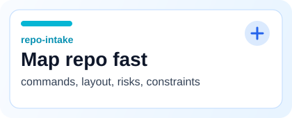
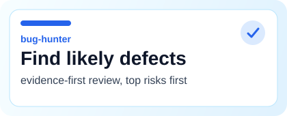
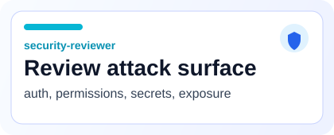
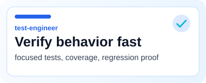
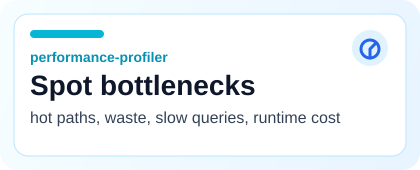
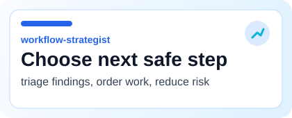

# Multi-Agent Dev Codex Skill

Reusable Codex skill for running senior-dev-style specialist agents inside Codex.

Natural-language first. Senior-dev-style roles. One skill, sixteen specialists, practical workflows.

> Built for repo intake, bug hunting, frontend debugging, testing, security review, performance review, architecture review, docs, accessibility, dependency review, database review, diff review, final merge review, focused fixing, and workflow triage.

`natural-language first` `16 specialist roles` `GitHub-ready` `practical review + fix workflows`

## Jump To

[Quickstart](#quickstart) | [Featured Agents](#featured-agents) | [Installation](#installation) | [Invocation](#invocation) | [All Agents](#all-agents) | [Workflows](#recommended-workflows)

## Quickstart

| Start here | Use when | Prompt |
| --- | --- | --- |
| Help | Need orientation | `Use the multi-agent-dev skill. Help me understand what each agent does and which one I should use.` |
| Inspect | Need fast repo mapping | `Use the multi-agent-dev skill. Run repo-intake only. Do not edit files. Map the project and identify the correct commands.` |
| Review | Need eyes on current changes | `Use the multi-agent-dev skill. Run diff-reviewer and test-engineer. Review the current git diff. Do not edit files.` |
| Fix | Need one issue solved carefully | `Use the multi-agent-dev skill. Run implementation-minimalist and test-engineer. Fix finding #1 only. Keep the change minimal.` |

## Featured Agents

<table>
  <tr>
    <td valign="top" width="33%">
      
    </td>
    <td valign="top" width="33%">
      
    </td>
    <td valign="top" width="33%">
      
    </td>
  </tr>
  <tr>
    <td valign="top" width="33%">
      
    </td>
    <td valign="top" width="33%">
      
    </td>
    <td valign="top" width="33%">
      
    </td>
  </tr>
</table>

## Installation

Skill installs by copying whole `multi-agent-dev` folder into Codex skills directory.

Windows:

```powershell
mkdir "$env:USERPROFILE\.codex\skills" -Force
Copy-Item ".\skills\multi-agent-dev" "$env:USERPROFILE\.codex\skills\multi-agent-dev" -Recurse -Force
```

macOS/Linux:

```bash
mkdir -p ~/.codex/skills
cp -R ./skills/multi-agent-dev ~/.codex/skills/multi-agent-dev
```

Restart Codex CLI / reload VS Code Codex extension after installing.

## Invocation

Agents are roles inside one Codex skill, not separate executables or separate UI buttons.

Start with:

```text
Use the multi-agent-dev skill.
Help me understand what each agent does and which one I should use.
```

List agents:

```text
Use the multi-agent-dev skill.
List available agents with one-line descriptions.
```

Repo intake:

```text
Use the multi-agent-dev skill.
Run repo-intake only.
Do not edit files.
Map the project and identify the correct commands.
```

Bug hunt:

```text
Use the multi-agent-dev skill.
Run bug-hunter only.
Do not edit files.
Find the top likely bugs in this repo.
```

Review current diff:

```text
Use the multi-agent-dev skill.
Run diff-reviewer and test-engineer.
Review the current git diff.
Do not edit files.
Afterward, ask me if I want workflow-strategist.
```

Fix one finding:

```text
Use the multi-agent-dev skill.
Run implementation-minimalist and test-engineer.
Fix finding #1 only.
Keep the change minimal.
Add or update tests if appropriate.
Run relevant tests if safe.
Afterward, recommend whether workflow-strategist should run next.
```

Workflow triage:

```text
Use the multi-agent-dev skill.
Run workflow-strategist only.
Triage the previous findings and recommend the safest fix order.
Do not edit files.
```

## All Agents

| Agent | Focus |
| --- | --- |
| `repo-intake` | Map repo shape, commands, risks, and working constraints before deeper work. |
| `codebase-cartographer` | Trace code paths, ownership boundaries, and subsystem relationships. |
| `bug-hunter` | Find highest-probability defects and rank them by severity and evidence. |
| `frontend-debugger` | Investigate browser/UI issues with DOM, network, console, and rendering evidence. |
| `test-engineer` | Design, add, update, and validate targeted test coverage. |
| `implementation-minimalist` | Fix one issue with smallest safe diff and low regression risk. |
| `security-reviewer` | Inspect auth, permissions, validation, secrets, and exposure risks. |
| `performance-profiler` | Look for hot paths, wasted work, slow queries, and runtime bottlenecks. |
| `architect-reviewer` | Review structure, coupling, abstractions, and long-term maintainability. |
| `docs-maintainer` | Improve docs, examples, onboarding guidance, and missing operational context. |
| `accessibility-reviewer` | Check keyboard flow, semantics, contrast, labels, and assistive support. |
| `workflow-strategist` | Triage findings, choose safest order, and recommend next workflow step. |
| `diff-reviewer` | Review current diff for bugs, regressions, missing tests, and scope drift. |
| `final-merge-reviewer` | Perform final pre-commit or pre-merge review across code, tests, and risks. |
| `dependency-reviewer` | Audit packages for risk, drift, unnecessary weight, and upgrade concerns. |
| `database-reviewer` | Review schema, queries, migrations, indexes, and data correctness risks. |

## Recommended Workflows

Inspect first:

```text
Use the multi-agent-dev skill.
Run repo-intake and bug-hunter.
Do not edit files.
Afterward, ask me if I want workflow-strategist.
```

Review changes:

```text
Use the multi-agent-dev skill.
Run diff-reviewer and test-engineer.
Review the current git diff.
Do not edit files.
```

Frontend/browser debugging:

```text
Use the multi-agent-dev skill.
Run frontend-debugger only.
Use Chrome DevTools MCP to inspect http://localhost:3000.
Do not edit files.
```

Security review:

```text
Use the multi-agent-dev skill.
Run security-reviewer only.
Focus on auth, permissions, API routes, input validation, secrets, and data exposure.
Do not edit files.
```

Fix one issue:

```text
Use the multi-agent-dev skill.
Run implementation-minimalist and test-engineer.
Fix finding #1 only.
Keep the change minimal.
```

Final review:

```text
Use the multi-agent-dev skill.
Run final-merge-reviewer only.
Review the current diff before commit or merge.
Do not edit files.
```

## Notes

- Skill can recommend stronger model for high-risk tasks, but cannot switch models automatically.
- Invocation banner appears when skill explicitly invoked.

## Contributing

- Keep `SKILL.md` natural-language first.
- Do not add fake commands unless documented as plain prompts.
- Preserve safety rules.
- Prefer small, practical agent additions.

## License

MIT. See [LICENSE](./LICENSE).
